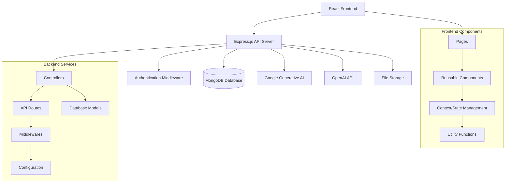
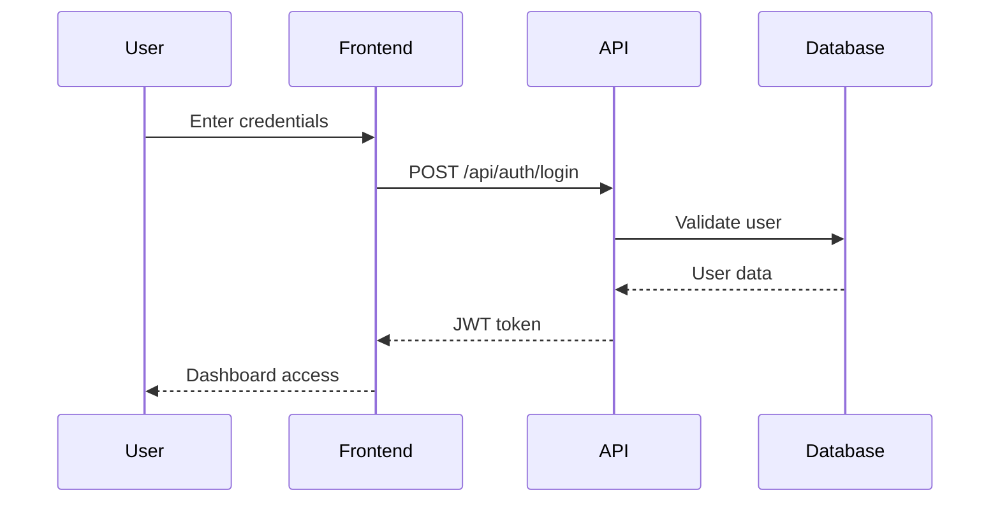
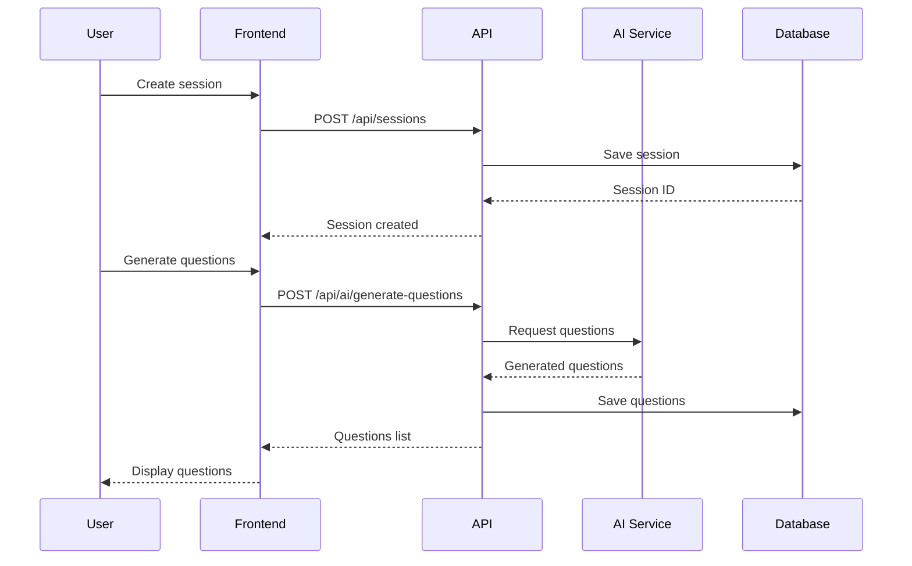
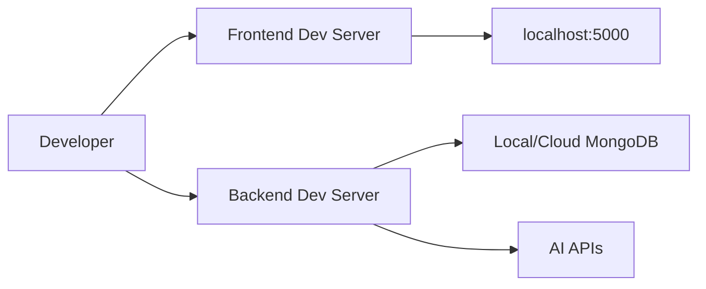
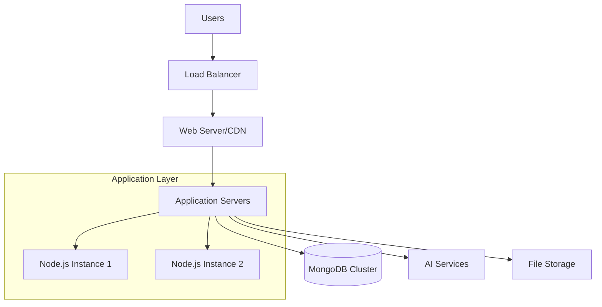

# Nail-It Architecture Documentation

## Overview

Nail-It is an AI-powered interview preparation platform that helps users practice technical interviews with AI-generated questions and explanations. The application follows a client-server architecture with a React frontend and Node.js backend.

## Technology Stack

### Backend
- **Runtime**: Node.js
- **Framework**: Express.js
- **Database**: MongoDB with Mongoose ODM
- **Authentication**: JWT (JSON Web Tokens)
- **Password Hashing**: bcryptjs
- **AI Integration**: 
  - Google Generative AI (@google/genai)
  - OpenAI API
- **File Upload**: Multer
- **Environment**: dotenv
- **CORS**: cors middleware
- **Development**: nodemon

### Frontend
- **Framework**: React 19.1.0
- **Build Tool**: Vite 7.0.4
- **Styling**: TailwindCSS 4.1.11
- **Animations**: Framer Motion 12.23.6
- **Routing**: React Router DOM 7.7.0
- **HTTP Client**: Axios 1.10.0
- **Notifications**: React Hot Toast 2.5.2
- **Markdown**: React Markdown 10.1.0
- **Syntax Highlighting**: React Syntax Highlighter 15.6.1
- **Date Handling**: Moment.js 2.30.1
- **Icons**: React Icons 5.5.0
- **Linting**: ESLint 9.30.1

## System Architecture



## Data Models

### User Model
```javascript
{
  _id: ObjectId,
  name: String (required),
  email: String (required, unique),
  password: String (required, hashed),
  profileImageUrl: String (optional),
  createdAt: Date,
  updatedAt: Date
}
```

### Session Model
```javascript
{
  _id: ObjectId,
  user: ObjectId (ref: User),
  role: String (required),
  experience: String (required),
  topicsToFocus: String (required),
  description: String (optional),
  questions: [ObjectId] (ref: Question),
  createdAt: Date,
  updatedAt: Date
}
```

### Question Model
```javascript
{
  _id: ObjectId,
  Session: ObjectId (ref: Session),
  question: String,
  answer: String,
  note: String,
  isPinned: Boolean (default: false),
  createdAt: Date,
  updatedAt: Date
}
```

## API Architecture

### Authentication Endpoints
- `POST /api/auth/register` - User registration
- `POST /api/auth/login` - User login
- Protected routes require JWT token in Authorization header

### Session Management
- `GET /api/sessions` - Get user sessions
- `POST /api/sessions` - Create new session
- `PUT /api/sessions/:id` - Update session
- `DELETE /api/sessions/:id` - Delete session

### Question Management
- `GET /api/questions` - Get questions for a session
- `POST /api/questions` - Create new question
- `PUT /api/questions/:id` - Update question
- `DELETE /api/questions/:id` - Delete question

### AI Integration
- `POST /api/ai/generate-questions` - Generate interview questions
- `POST /api/ai/generate-explanation` - Generate concept explanations

## Component Architecture

### Frontend Structure
```
src/
├── components/          # Reusable UI components
├── context/            # React Context for state management
├── pages/              # Page components
│   ├── Auth/           # Authentication pages
│   ├── Home/           # Dashboard/Home pages
│   ├── NailIt/         # Main application pages
│   └── LandingPage.jsx # Landing page
├── utils/              # Utility functions
├── assets/             # Static assets
├── App.jsx             # Main App component
└── main.jsx           # Application entry point
```

### Backend Structure
```
backend/
├── config/             # Database and configuration
├── controllers/        # Business logic
│   ├── authController.js
│   ├── sessionController.js
│   ├── questionController.js
│   └── aiController.js
├── middlewares/        # Custom middleware
│   └── authMiddleware.js
├── models/             # Database models
│   ├── User.js
│   ├── Session.js
│   └── Question.js
├── routes/             # API route definitions
│   ├── authRoutes.js
│   ├── sessionRoutes.js
│   └── questionRoutes.js
├── utils/              # Utility functions
├── uploads/            # File storage directory
└── server.js           # Application entry point
```

## Data Flow

### User Authentication Flow


### Interview Session Flow


## Security Considerations

### Authentication & Authorization
- JWT tokens for stateless authentication
- Password hashing using bcryptjs
- Protected routes with authentication middleware
- Token-based session management

### Data Protection
- Input validation and sanitization
- CORS configuration for cross-origin requests
- Environment variables for sensitive data
- Secure file upload handling

### API Security
- Rate limiting (recommended for production)
- Request validation
- Error handling without information leakage
- HTTPS enforcement (production)

## Deployment Architecture

### Development Environment


### Production Environment (Recommended)


## Environment Configuration

### Required Environment Variables
```env
# Database
MONGODB_URI=mongodb://localhost:27017/nail-it

# Authentication
JWT_SECRET=your-jwt-secret-key

# AI Services
GOOGLE_AI_API_KEY=your-google-ai-key
OPENAI_API_KEY=your-openai-key

# Server
PORT=5000
NODE_ENV=development

# CORS
ALLOWED_ORIGINS=http://localhost:3000
```

## Development Setup

### Backend Setup
```bash
cd backend
npm install
npm run dev  # Development with nodemon
npm start    # Production
```

### Frontend Setup
```bash
cd frontend/Nail-It
npm install
npm run dev    # Development server
npm run build  # Production build
```

## Performance Considerations

### Backend Optimizations
- Database indexing on frequently queried fields
- Connection pooling for MongoDB
- Caching for AI responses
- Async/await for non-blocking operations

### Frontend Optimizations
- Code splitting with React.lazy()
- Image optimization
- Bundle size optimization with Vite
- Lazy loading for components

## Monitoring & Logging

### Recommended Tools
- Application monitoring (e.g., New Relic, DataDog)
- Error tracking (e.g., Sentry)
- Performance monitoring
- Database monitoring
- Log aggregation

## Future Enhancements

### Scalability Improvements
- Microservices architecture
- Redis for caching and session storage
- Message queues for async processing
- CDN for static assets

### Feature Enhancements
- Real-time collaboration
- Video/audio recording
- Advanced analytics
- Machine learning for personalized questions
- Integration with more AI providers

## API Documentation

### Response Format
```javascript
// Success Response
{
  "success": true,
  "data": {...},
  "message": "Optional message"
}

// Error Response
{
  "success": false,
  "error": "Error message",
  "details": "Optional error details"
}
```

### Authentication
All protected endpoints require the Authorization header:
```
Authorization: Bearer <jwt-token>
```

This architecture provides a solid foundation for the Nail-It interview preparation platform, with clear separation of concerns, scalable design patterns, and room for future enhancements.